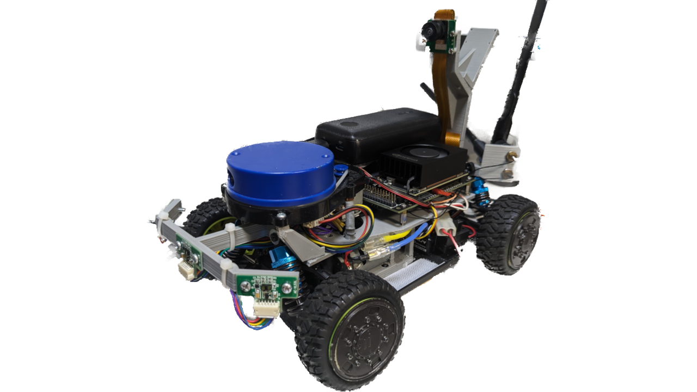
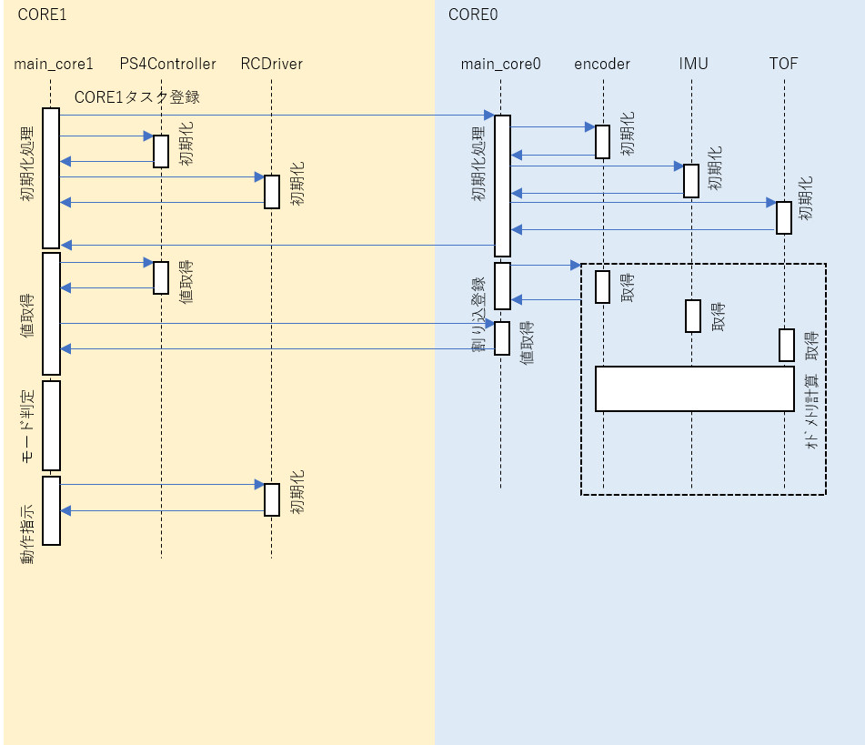

# adrc2023

Auto Drive RC: 自動運転ラジコン2023のリポジトリ



---

## 全体構成


## シーケンス図



## コマンド集

```bash
docker run -it --rm -v /dev:/dev -v /dev/shm:/dev/shm --privileged --net=host microros/micro-ros-agent:foxy serial --dev /dev/ttyTHS0 
```

```bash
docker run -it --rm -v /dev:/dev -v /dev/shm:/dev/shm --privileged --net=host nvidiajetson/deepstream-ros2-foxy:5.0.1 
```

```bash
gst-launch-1.0 -v nvarguscamerasrc sensor-id=1 ! 'video/x-raw(memory:NVMM),format=NV12' ! nv3dsink
```

```bash
gst-launch-1.0 -v nvarguscamerasrc sensor-id=0 ! 'video/x-raw(memory:NVMM),fromat=NV12,width=1270,height=720' ! tee name=t ! queue ! nv3dsink sync=false t. ! queue ! nvvidconv ! "video/x-raw" ! videoconvert ! "video/x-raw,width=320,height=240,framerate=30/1" ! jpegenc ! rtpjpegpay ! udpsink host=192.168.3.9 port=8554 sync=false
```

```bash
gst-launch-1.0 udpsrc port=8554 ! "application/x-rtp,encoding-name=JPEG" ! rtpjpegdepay ! jpegdec ! videoconvert ! autovideosink
```