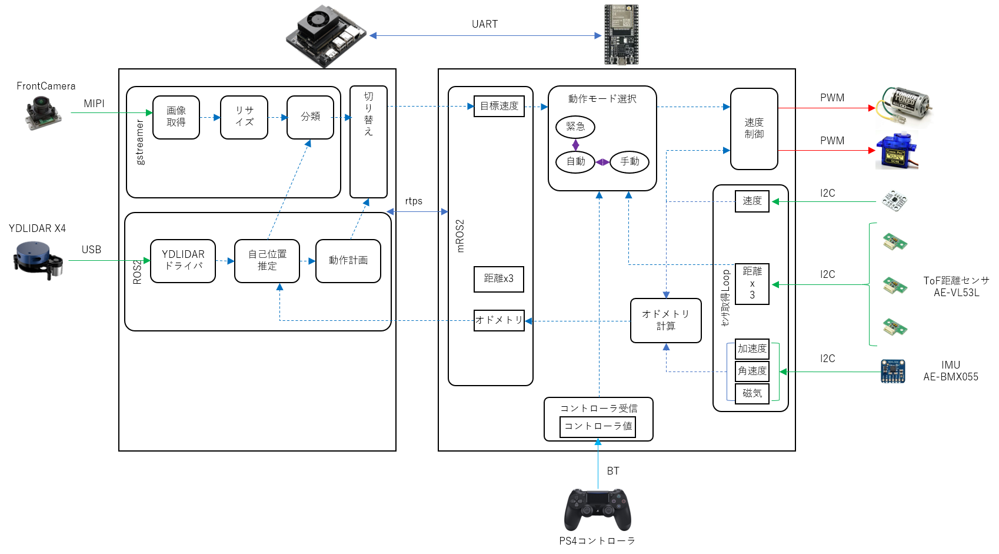

# adrc2023

Auto Drive RC: 自動運転ラジコン2023のリポジトリ


---

## 全体構成



## シーケンス図


##

```bash
docker run -it --rm -v /dev:/dev -v /dev/shm:/dev/shm --privileged --net=host microros/micro-ros-agent:foxy serial --dev /dev/ttyTHS0 
```
